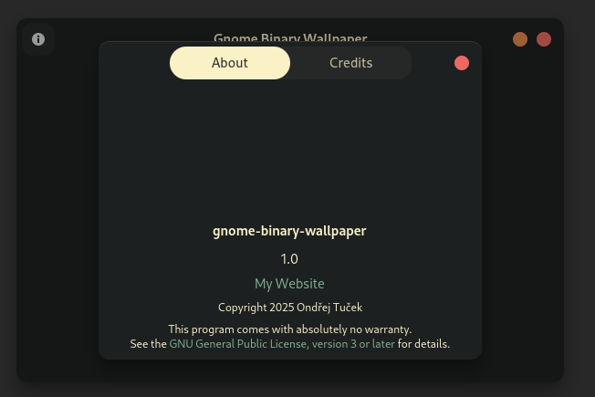

# Gnome Binary Wallpaper



A simple GTK4 + Python app to generate GNOME-compatible binary wallpapers with light and dark variants.  
Select two images, name your wallpaper, and the app will handle the copying and XML generation.

---

## ✨ Features

- GTK4 GUI using Python
- Select light and dark wallpapers
- Automatically generates XML config for GNOME

---

## 📦 Requirements

- Python 3.10+
- GTK 4.0
- PyGObject-stubs

> You can install dev requirements:

```bash
pip install -r requirements.txt
```
